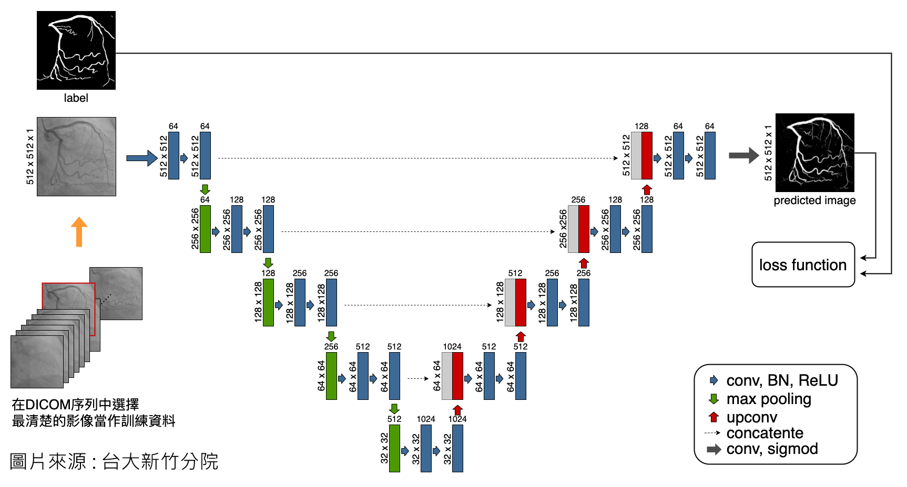

# vessel_segmentation
This repo is a python code to vessel segmentation

## Hardware 
GPU : Nvidia Tesla V100 or NVIDIA TITAN Xp

## Framework
Tensorflow(GPU) : 1.14.0 <br>
Keras : 2.2.5 <br>
CUDA : 10.1

## FlowChart


## Getting Started
### Installing
```
git clone https://github.com/e9190712/vessel_segmentation
cd vessel_segmentation
```
### Prerequisites
The `requirements.txt` file should list all Python libraries that the program
 depends on, and they will be installed using:

```
pip install -r requirements.txt
```
or use my Sharing Environments
```
conda env create -f tf_1_14_0_keras.yaml
```
### Usage
train_parameter.conf --> main_conf.py <br>
test_parameter.conf --> test_conf.py <br>
About ```--backbone``` you can ref to (https://github.com/qubvel/segmentation_models) <br>
About ```--backbone --> original``` you can ref to (https://arxiv.org/pdf/1505.04597.pdf)

## Performance
| BackBone                          |     Loss Function         |     F1         |
|----------------------------------|----------------------|----------------------|
| SE-Net154|     Dice Loss          |     0.8963          |
| SE-Net154|     BCE             |     0.8944          |
| DenseNet121|     Dice Loss          |     0.8753          |
| DenseNet121|     BCE           |     0.8753          |
| InceptionResNetV2|     Dice Loss          |     0.8695          |
| InceptionResNetV2|     BCE           |     0.8671          |